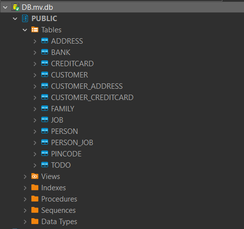
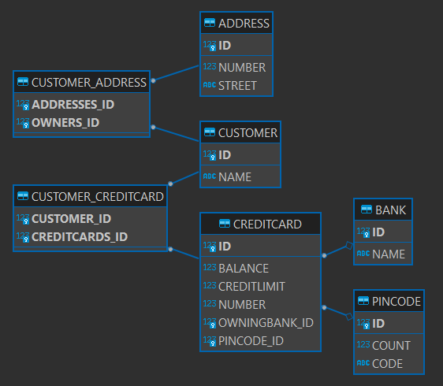

# Technical Problems

There is a difference between Collection and Set, which made debugging the tests "difficult".

I also encountered issues with the H2 version, while using datagrip. I am unsure if this is a H2 issue or datagrip issue.

# How I inspected the database

I tried using datagrip, but I encountered some issues to the H2 version.

~~But, since it was relativly straightforward input, I could visualize it, and since the test passed, I assumed everything worked.~~

Changing the version of H2, and using DBeaver, made it work.

# Picutres

